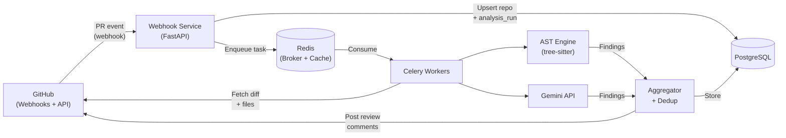
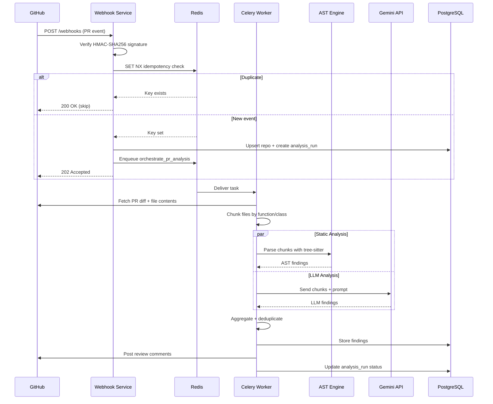
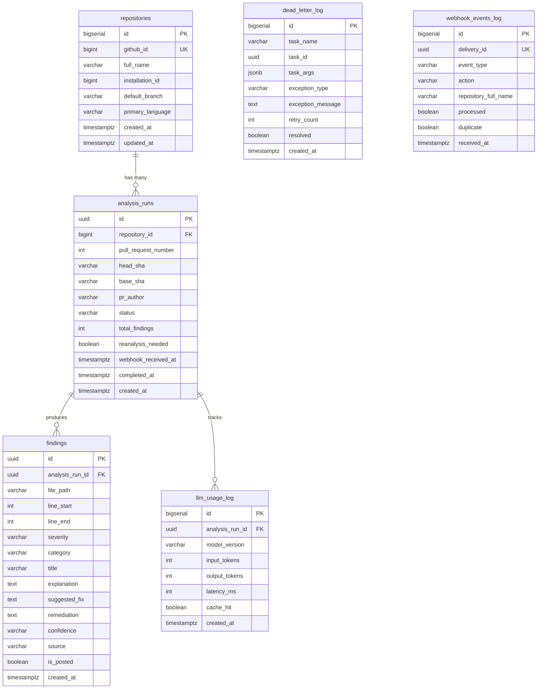

# CodePulse AI

**AI-powered code review that catches security vulnerabilities and memory leaks before they reach production.**

CodePulse AI is a GitHub App that automatically reviews pull requests using a combination of static analysis (AST-based pattern matching via tree-sitter) and LLM-powered analysis (Google Gemini). When a developer opens or updates a PR, CodePulse analyzes the changed code and posts inline review comments highlighting potential issues — complete with explanations and suggested fixes.

---

## Phase Status

| Phase | Description | Status |
|-------|-------------|--------|
| **1** | Project skeleton + data model | ✅ Done |
| **2** | Webhook ingestion service | 🔲 Planned |
| **3** | AST analysis engine (Python, JS/TS) | 🔲 Planned |
| **4** | LLM analysis engine (Gemini) | 🔲 Planned |
| **5** | Aggregation, dedup, GitHub review posting | 🔲 Planned |
| **6** | Celery orchestration wiring | 🔲 Planned |
| **7** | Failure handling (retry, circuit-breaker, dead-letter) | 🔲 Planned |
| **8** | Kubernetes/Helm + observability | 🔲 Planned |

---

## How It Works

When a pull request is opened on a connected repository, GitHub sends a webhook to CodePulse. The system verifies the webhook signature, checks for duplicates, and kicks off a background analysis pipeline. That pipeline fetches the PR diff, runs both AST and LLM analysis in parallel, deduplicates the findings, and posts the results as GitHub review comments.

### High-Level Architecture



### Pipeline Sequence

This shows the full lifecycle of a single pull request event, from webhook receipt to review comments appearing on GitHub:



### Database Schema

Six tables track everything from repository metadata to individual findings and operational telemetry:



---

## What's Implemented

### Phase 1 — Project Skeleton + Data Model

- **Poetry** for dependency management (Python 3.12, FastAPI, Celery, SQLAlchemy, Alembic, Redis, Pydantic)
- **Docker Compose** with PostgreSQL 16 and Redis 7.2 for local development
- **Alembic migrations** creating all 6 tables with proper constraints, indexes, and foreign keys
- **SQLAlchemy ORM models** with full relationship mappings
- **Pydantic settings** loading all configuration from environment variables
- **30 unit tests** validating model metadata, constraints, and instantiation

---

## Getting Started

### Prerequisites

- **Docker Desktop** (for PostgreSQL and Redis)
- **Python 3.12+** (for running tests locally)
- **Poetry** (`pip install poetry`)

### Run the Stack

```bash
# Start Postgres + Redis and run migrations
docker compose up --build -d

# Verify the schema
PYTHONPATH=src python scripts/verify_schema.py
```

### Run Tests

```bash
# Install dev dependencies
poetry install

# Run all tests (no Docker needed)
PYTHONPATH=src python -m pytest tests/ -v
```

---

## Project Structure

```
src/codepulse/
├── config.py                 # Pydantic settings (env vars)
├── models/
│   ├── base.py               # SQLAlchemy DeclarativeBase
│   └── tables.py             # All 6 ORM models
├── persistence/
│   └── database.py           # Engine + session factory
├── ingestion/                # Phase 2: webhook service
├── worker/                   # Phase 6: Celery orchestration
├── analysis/                 # Phase 3-4: AST + LLM engines
├── aggregation/              # Phase 5: dedup + review posting
└── common/                   # Shared utilities
```

---

## Design Decisions

See [DECISIONS.md](DECISIONS.md) for a log of all architecture decisions, especially where the implementation diverges from or clarifies the architecture document.
